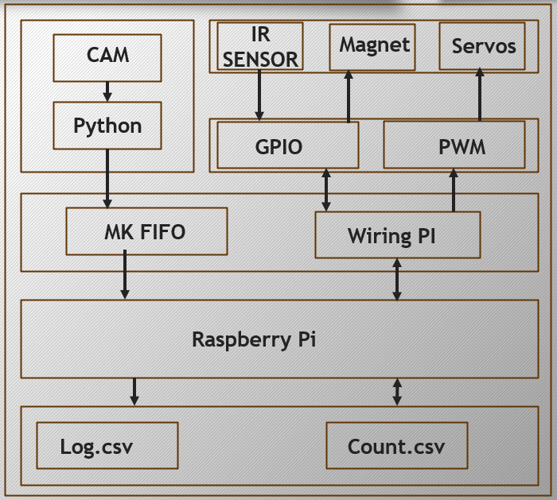
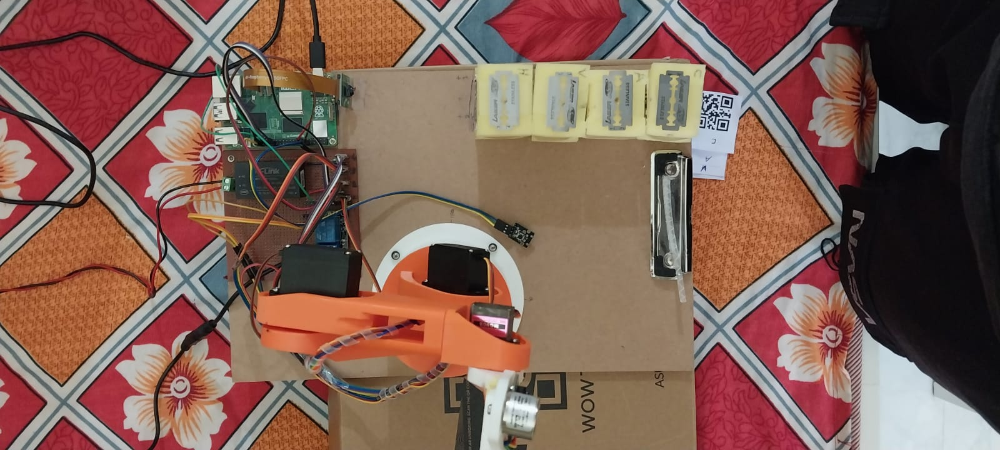
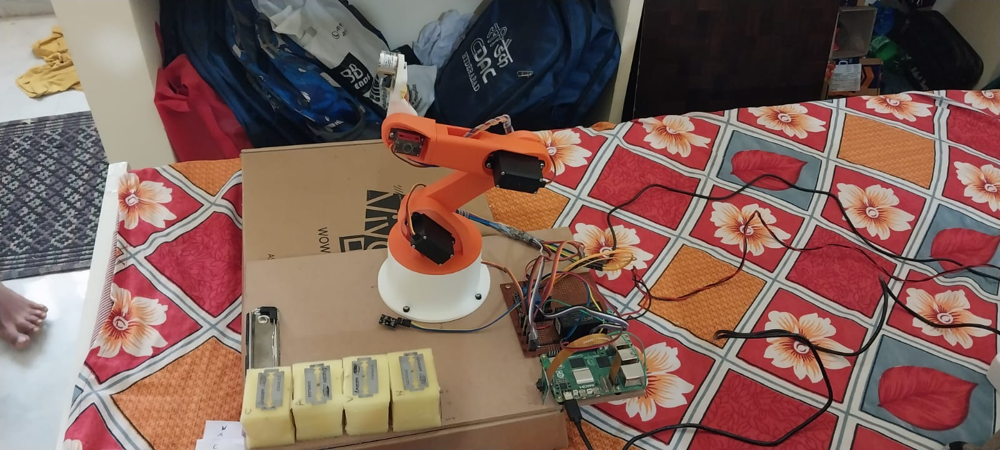
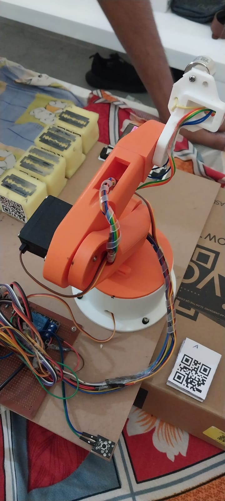
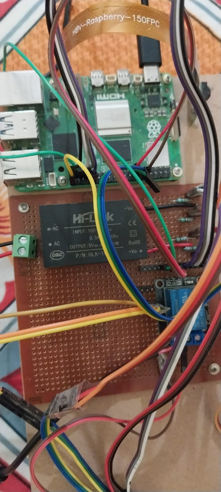
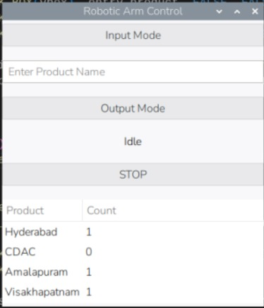
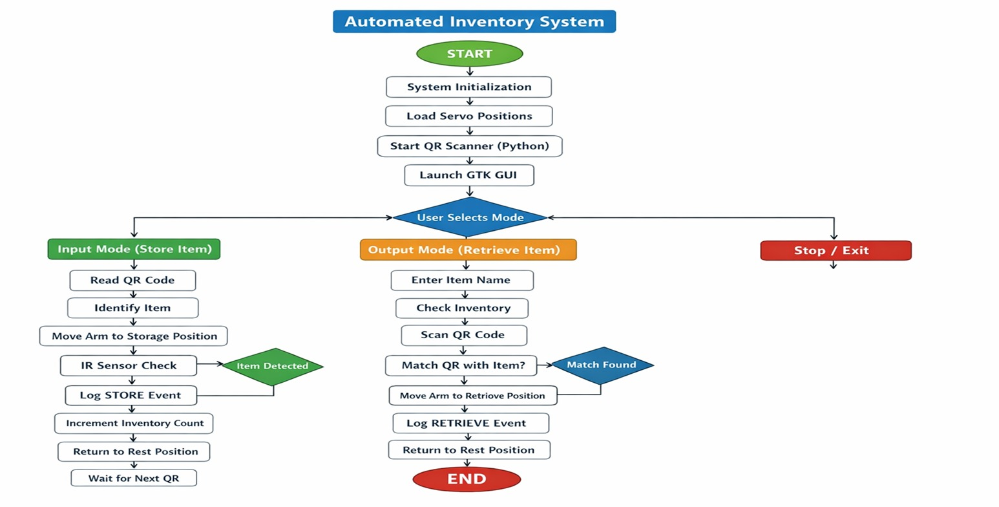

# 📦 Smart Warehouse Item Segregator and Dispatcher

An **ARM-based automated inventory management system** using a **robotic arm**, **QR code identification**, and a **Linux GUI application** running on a **Raspberry Pi**.  
This project automates **storage, segregation, dispatching, and real-time inventory tracking** of products.

---

## 🔍 Project Overview

Manual inventory management is slow, error-prone, and requires continuous human intervention.  
This project demonstrates how **embedded Linux**, **inter-process communication (IPC)**, and **robotic automation** can be integrated to build a **smart warehouse system**.

The system:
- Identifies products using **QR codes**
- Segregates and dispatches items automatically
- Stores and retrieves items using a **robotic arm**
- Updates inventory count in real time
- Provides a **GUI-based interface** for user interaction

---

## 🧠 System Architecture

### 📐 Architecture Diagram

> The architecture shows the interaction between the camera, Python-based QR detection, FIFO-based IPC, WiringPi GPIO/PWM control, sensors, servos, and inventory log files running on the Raspberry Pi.

### Hardware Components
- Raspberry Pi (ARM Processor)
- Servo-based Robotic Arm (Multi-DOF)
- IR Sensor
- Electromagnet / Gripper
- Relay Module
- 5V SMPS Power Supply (HLK series)
- QR Code Labels
- Custom Control and Driver Board

### Software Components
- Raspberry Pi OS (Linux)
- C Programming
- Python (QR Code Scanner)
- GTK (GUI)
- POSIX Threads (`pthread`)
- IPC using FIFO (`mkfifo`)
- WiringPi (GPIO & PWM)
- CSV files for inventory logging

---

## 🖼️ Hardware Setup & Visualization

### 🔧 Robotic Arm Assembly and Operation

| Front View | Side View |
|-----------|----------|
|  |  |

| Close-Up View |
|--------------|
|  |

---

### ⚙️ Raspberry Pi Control Board

| Raspberry Pi & Power Module |
|-----------------------------|
|  |

> Raspberry Pi acts as the central controller, managing GUI, IPC, file handling, sensor input, and servo control.

---

## 🖥️ GUI Interface Visualization

### 📊 Inventory Management GUI

> The GTK-based GUI allows the user to select modes, enter product names, monitor inventory counts, and control system operation.

---

## 🔄 Working Flow

### 🔁 Operational Flow Diagram

> This flowchart represents the complete working logic of the system, from initialization to item storage, retrieval, logging, and termination.

### 1️⃣ System Startup
- Raspberry Pi boots into Linux
- Main program initializes:
  - GPIO and PWM
  - FIFO (Named Pipe)
  - GUI components
  - Servo position data
  - Threads for motor control and file handling
- Python QR scanner process is launched

---

### 2️⃣ Input Mode (Storage & Segregation)
1. User selects **Input Mode**
2. QR code is scanned using the camera
3. Item is identified
4. Robotic arm moves to storage position
5. IR sensor confirms item placement
6. STORE event is logged
7. Inventory count is incremented
8. Arm returns to rest position

---

### 3️⃣ Output Mode (Retrieval & Dispatch)
1. User selects **Output Mode**
2. Item name is entered via GUI
3. Inventory availability is checked
4. QR code is scanned for verification
5. Matching item is found
6. Robotic arm retrieves the item
7. RETRIEVE event is logged
8. Inventory count is decremented
9. Arm returns to rest position

---

### 4️⃣ Inter-Process Communication
- Python (QR Scanner) and C (Main Control) run as **separate processes**
- Communication via **FIFO (`mkfifo`)**
- Ensures synchronized and safe data exchange

---

## 🧵 Software Design

### Multi-Process Architecture
- `fork()` is used to separate:
  - GUI process
  - Robotic control logic
- Improves reliability and fault isolation

### Multi-Threading
Threads handle:
- Servo motor movement
- Sensor monitoring
- Inventory file read/write operations
- GUI responsiveness

### IPC Mechanism
- FIFO (Named Pipe)
- Simple, reliable, and easy to debug
- Suitable for related processes

---

## 🖥️ GUI Features

- Input Mode / Output Mode selection
- Product name entry
- STOP and Idle control
- Live inventory table
- GTK-based user-friendly interface

---

## ✨ Key Features

- Automated item segregation and dispatch
- QR code-based identification
- Real-time inventory tracking
- ARM-based embedded Linux system
- GUI-controlled operation
- FIFO-based inter-process communication
- Multi-threaded robotic control
- Modular and scalable design
